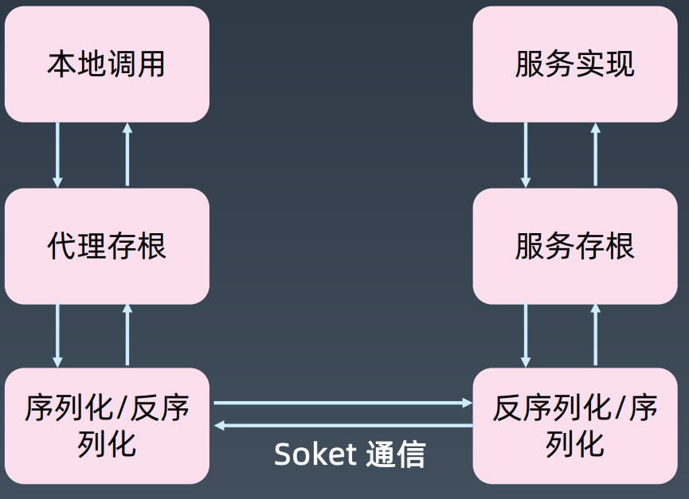

# WmRPC 框架
## 打包部署
> jdk 17 maven 3.6+

```java
# 打包
mvn clean package
# 发布
mvn clean deploy -P release
```
## RPC 传输过程


## 实现功能
- [x] 网络协议
  - [x] HTTP
  - [x] TCP
- [x] 序列化协议
  - [x] JSON
  - [ ] Hisson
- [x] 服务、实例、服务端元数据描述
- [x] 服务提供者Skeleton
  - [x] 服务端寻址
  - [x] 注解支持
  - [x] 优雅启动
- [x] 服务消费者Stub
  - [x] 客户端调用关系
  - [x] 注解支持
- [x] 支持服务端方法重载
- [x] 兼容一个实现类同时实现多个服务接口
- [x] 服务端和消费者端参数及返回值类型转换
- [x] 支持注册中心
  - [x] Zookeeper
    - [x] 优雅启动注册
    - [x] 优雅停机关闭
    - [x] Namespace 隔离
    - [x] 实现监听机制，支持动态更新 instance 节点
    - [ ] curator-x-discovery重新实现zk rc
  - [ ] Nacos
- [x] 支持配置中心
  - [x] Apollo，实现监听机制，支持动态更新 Bean 配置
  - [ ] Nacos
- [x] 支持负载均衡
  - [x] 随机
  - [x] 轮询
  - [ ] 一致性哈希
  - [ ] 权重
- [x] 前置后置过滤器机制
  - [x] 缓存过滤器
  - [x] Mock过滤器
  - [x] 上下文传参过滤器
  - [ ] 流量控制
- [x] 重试机制
- [x] 消费者端故障隔离机制
- [x] 消费者端故障隔离探活机制及自动恢复机制
- [x] 服务端流控机制
  - [x] 时间窗口
  - [ ] 令牌桶
- [x] 消费者和服务端上下文传参机制
- [x] 灰度发布机制
- [x] 支持打包发布

## 待完善
- [ ] Spring starter 支持
- [ ] 支持 Netty 替换 SpringWEB
- [ ] SPI机制
- [ ] 异步调用
- [ ]类型转换中，支持泛型无限嵌套